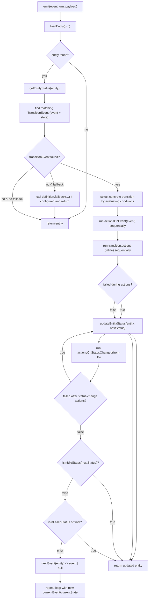

<picture>
  <source media="(prefers-color-scheme: dark)" srcset="https://joseescrich.com/logos/nestjs-workflow.png">
  <source media="(prefers-color-scheme: light)" srcset="https://joseescrich.com/logos/nestjs-workflow-light.png">
  
</picture>

# NestJS Workflow & State Machine

A flexible workflow engine built on top of NestJS framework, enabling developers to create, manage, and execute complex workflows in their Node.js applications.

## 🎯 Live Examples & Demos

Explore fully functional examples with **interactive visual demos** in our dedicated examples repository:

### 👉 **[View Examples Repository](https://github.com/@nestjs-serverless-workflow-examples)**

The repository includes three comprehensive real-world examples:

1. **🚀 User Onboarding Workflow** - Multi-step verification, KYC/AML compliance, risk assessment
2. **📦 Order Processing System** - Complete e-commerce lifecycle with payment retry logic
3. **📊 Kafka-Driven Inventory** - Real-time event-driven inventory management with Kafka integration

Each example features:

- ✨ **Interactive Visual Mode** - See workflows in action with real-time state visualization
- 🎮 **Interactive Controls** - Manually trigger transitions and explore different paths
- 🤖 **Automated Scenarios** - Pre-built test cases demonstrating various workflow paths
- 📝 **Full Source Code** - Production-ready implementations you can adapt

**[➡️ Get Started with Examples](https://github.com/@nestjs-serverless-workflow-examples#-quick-start)**

## Table of Contents

- [Features](#features)
- [Stateless Architecture](#stateless-architecture)
- [Installation](#installation)
- [Quick Start](#quick-start)
- [Module Registration](#module-registration)
- [Define a Workflow](#define-a-workflow)
- [Message Format](#message-format)
- [Configuring Actions and Conditions](#configuring-actions-and-conditions)
- [Complete Example with Kafka Integration](#complete-example-with-kafka-integration)

## Features

- Workflow Definitions: Define workflows using a simple, declarative syntax
- State Management: Track and persist workflow states
- Event-Driven Architecture: Built on NestJS's event system for flexible workflow triggers
- Transition Rules: Configure complex transition conditions between workflow states
- Extensible: Easily extend with custom actions, conditions, and triggers
- TypeScript Support: Full TypeScript support with strong typing
- Integration Friendly: Seamlessly integrates with existing NestJS applications
- Kafka Integration: Easily integrate with Kafka for event-driven workflows
- Stateless Design: Lightweight implementation with no additional storage requirements

Documentation: https://@nestjs-serverless-workflow.github.io/libraries/docs/workflow/intro

# Stateless Architecture

## NestJS Workflow is designed with a stateless architecture, which offers several key benefits

Benefits of Stateless Design

- Simplicity: No additional database or storage configuration required
- Domain-Driven: State is maintained within your domain entities where it belongs
- Lightweight: Minimal overhead and dependencies
- Scalability: Easily scales horizontally with your application
- Flexibility: Works with any persistence layer or storage mechanism
- Integration: Seamlessly integrates with your existing data model and repositories
- The workflow engine doesn't maintain any state itself - instead, it operates on your domain entities, reading their current state and applying transitions according to your defined rules. This approach aligns with domain-driven design principles by keeping the state with the entity it belongs to.

This stateless design means you can:

Use your existing repositories and data access patterns
Persist workflow state alongside your entity data
Avoid complex synchronization between separate state stores
Maintain transactional integrity with your domain operations

```
// Example of how state is part of your domain entity
export class Order {
  id: string;
  items: OrderItem[];
  totalAmount: number;
  status: OrderStatus; // The workflow state is a property of your entity

  // Your domain logic here
}
```

The workflow engine simply reads and updates this state property according to your defined transitions, without needing to maintain any separate state storage.

## Installation

```bash
npm install @nestjs-serverless-workflow
```

Or using yarn:

```bash
yarn add @nestjs-serverless-workflow
```

## Quick Start

### 🎮 Try the Interactive Demos First

Before diving into code, experience workflows visually with our interactive demos:

```bash
# Quick demo setup
git clone https://github.com/@nestjs-serverless-workflow-examples.git
cd nestjs-workflow-examples/01-user-onboarding
npm install && npm run demo
```

You'll see an interactive workflow visualization like this:

```
╔══════════════╗     ┌──────────────┐     ┌────────────────┐
║  REGISTERED  ║ --> │EMAIL_VERIFIED│ --> │PROFILE_COMPLETE│
╚══════════════╝     └──────────────┘     └────────────────┘
   (current)                ↓                      ↓
                    ┌──────────────┐      ┌─────────────────┐
                    │   SUSPENDED  │      │IDENTITY_VERIFIED│
                    └──────────────┘      └─────────────────┘
                                                   ↓
                                             ╔══════════╗
                                             ║  ACTIVE  ║
                                             ╚══════════╝
```

**[🚀 Explore All Examples](https://github.com/@nestjs-serverless-workflow-examples)**

### How It Works

When you configure SQS integration:

1. The workflow engine will connect to the specified SQS queue
2. It will subscribe to the topics you've defined in the `events` array
3. When a message arrives on a subscribed topic, the workflow engine will:
   - Map the topic to the corresponding workflow event
   - Extract the entity URN from the message
   - Load the entity using your defined `entity.load` function
   - Emit the mapped workflow event with the Kafka message as payload

### Complete Example with SQS Integration

````typescript
import { Module } from '@nestjs/common';
import { WorkflowModule, Workflow, OnEvent, Payload, Entity } from '@nestjs-serverless-workflow';
import { OrderEntityService } from './order-entity.service';


// Define your entity and state/event enums
export enum OrderEvent {
  Create = 'order.create',
  Submit = 'order.submit',
  Complete = 'order.complete',
  Fail = 'order.fail',
}

export enum OrderStatus {
  Pending = 'pending',
  Processing = 'processing',
  Completed = 'completed',
  Failed = 'failed',
}

export class Order {
  id: string;
  name: string;
  price: number;
  items: string[];
  status: OrderStatus;
}
@Workflow({
    states: {
      finals: [OrderStatus.Completed, OrderStatus.Failed],
      idles: [OrderStatus.Pending, OrderStatus.Processing, OrderStatus.Completed, OrderStatus.Failed],
      failed: OrderStatus.Failed,
    },
    transitions: [
      // Your transitions here
      {
        from: OrderStatus.Pending,
        to: OrderStatus.Processing,
        event: OrderEvent.Submit,
        conditions: [(entity: Order, payload: any) => entity.price > 10],
      },
      {
        from: OrderStatus.Processing,
        to: OrderStatus.Completed,
        event: OrderEvent.Complete,
      },
      {
        from: OrderStatus.Processing,
        to: OrderStatus.Failed,
        event: OrderEvent.Fail,
      }
    ],
  };
})
class OrderWorkflowDefinition {
  @OnEvent(OrderEvent.Submit)
  async onSubmit(@Entity entity: Order, @Payload(YourClassValidatorDto) submitData): Promise<Order> {
    // Custom logic on submit event
  }
}

@Module({
  imports: [
    WorkflowModule.register({
      providers: [
        {
          provide: OrderWorkflowDefinition,
          useFactory: (orderEntityService: OrderEntityService, eventEmitter: EventEmitter2) => {
            return new OrderWorkflowDefinition(orderEntityService, eventEmitter);
          },
          inject: [OrderEntityService, EventEmitter2]
        }
      ]
    }),
  ],
})
export class AppModule {}
```

### Message Format

The Kafka messages should include the entity URN so that the workflow engine can load the correct entity. For example:

```json
{
  "urn": "order-123",
  "price": 150,
  "items": ["Item 1", "Item 2"]
}
```

With this setup, your workflow will automatically react to Kafka messages and trigger the appropriate state transitions based on your workflow definition.

### Benefits of Using EntityService

Using a dedicated EntityService provides several advantages:

1. **Separation of Concerns**: Keep entity management logic separate from workflow definitions
2. **Dependency Injection**: Leverage NestJS dependency injection for your entity operations
3. **Reusability**: Use the same EntityService across multiple workflows
4. **Testability**: Easier to mock and test your entity operations
5. **Database Integration**: Cleanly integrate with your database through repositories

This approach is particularly useful for complex applications where entities are stored in databases and require sophisticated loading and persistence logic.

## 📚 Examples & Learning Resources

### Interactive Examples Repository
The best way to learn is by exploring our **[comprehensive examples repository](https://github.com/@nestjs-serverless-workflow-examples)** which includes:

#### 1. User Onboarding Workflow Example
Demonstrates a real-world user registration and verification system:
- Progressive profile completion with automatic transitions
- Multi-factor authentication flows
- Risk assessment integration
- Compliance checks (KYC/AML)
- States: `REGISTERED` → `EMAIL_VERIFIED` → `PROFILE_COMPLETE` → `IDENTITY_VERIFIED` → `ACTIVE`

#### 2. E-Commerce Order Processing Example
Complete order lifecycle management system:
- Payment processing with retry logic
- Inventory reservation and management
- Multi-state shipping workflows
- Refund and return handling
- States: `CREATED` → `PAYMENT_PENDING` → `PAID` → `PROCESSING` → `SHIPPED` → `DELIVERED`

#### 3. Message-Driven Inventory Management
Event-driven inventory system with Message Brokers integration:
- Real-time stock level updates via Message Broker events
- Automatic reorder triggering
- Quality control and quarantine workflows
- Multi-warehouse support
- Special states for `QUARANTINE`, `AUDITING`, `DAMAGED`, `EXPIRED`

### Running the Examples

```bash
# Clone the examples repository
git clone https://github.com/@nestjs-serverless-workflow-examples.git
cd nestjs-workflow-examples

# Install all examples
npm run install:all

# Run interactive demos with visual workflow diagrams
npm run demo:user-onboarding    # User onboarding demo
npm run demo:order-processing   # Order processing demo
npm run demo:kafka-inventory    # Kafka inventory demo
```

The interactive demos feature:
- **ASCII-art workflow visualization** showing current state and possible transitions
- **Real-time state updates** as you interact with the workflow
- **Menu-driven interface** to trigger events and explore different paths
- **Automated scenarios** to demonstrate various workflow patterns

## Advanced Usage
For more advanced usage, including custom actions, conditions, and event handling, please check the documentation and explore the examples repository.
```

State Machine flow chart

````
