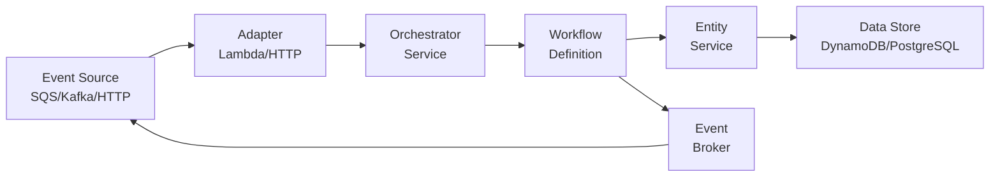

# Documentation

Welcome to the serverless-workflow documentation!

## Table of Contents

### Getting Started
- [Getting Started Guide](./getting-started.md) - Installation and basic usage

### Core Modules
- [Workflow Module](./workflow.md) - State machines, transitions, and event handling
- [Event Bus](./event-bus.md) - Message broker integration (SQS, Kafka, RabbitMQ)
- [Adapters](./adapters.md) - Runtime adapters (AWS Lambda, HTTP)

### Examples
- [Order Processing](../examples/order/) - Complete order workflow example
- [DynamoDB Integration](../examples/dynamodb/) - Entity persistence with DynamoDB
- [Usage Examples](../examples/usage/) - Entry point examples for Lambda and HTTP

## Quick Links

### Installation

```bash
bun add serverless-workflow
```

### Basic Import

```typescript
import { WorkflowModule } from 'serverless-workflow/workflow';
import { IBrokerPublisher } from 'serverless-workflow/event-bus';
import { LambdaEventHandler } from 'serverless-workflow/adapter';
import { UnretriableException } from 'serverless-workflow/exception';
```

## Architecture Overview



## Key Features

### 🌲 Tree-Shakable
Modern subpath exports ensure you only bundle what you use:
```typescript
import { WorkflowModule } from 'serverless-workflow/workflow';
// Only workflow code is included in your bundle
```

### 🎯 Stateless Architecture
No additional storage required - state lives in your domain entities:
```typescript
export class Order {
  status: OrderStatus; // Workflow state
  // Your domain properties
}
```

### 🔄 Event-Driven
React to events from any source:
- SQS Messages
- Kafka Topics
- HTTP Requests
- EventBridge Events

### ⚡ Serverless-Ready
Optimized for AWS Lambda with automatic timeout handling and batch processing.

### 🛡️ Type-Safe
Full TypeScript support with strong typing throughout.

## Module Structure

```
serverless-workflow/
├── workflow/        # Core workflow engine
│   ├── decorators/  # @Workflow, @OnEvent, @WithRetry
│   ├── providers/   # OrchestratorService, RouterService
│   ├── types/       # Interfaces and types
│   └── utils/       # Retry logic and helpers
├── event-bus/       # Event publishing
│   ├── sqs/        # SQS emitter
│   └── types/      # Event interfaces
├── adapter/         # Runtime adapters
│   └── lambda/     # AWS Lambda adapter
└── exception/       # Custom exceptions
    └── unretriable/ # Non-retriable errors
```

## Community & Support

- **Issues**: [GitHub Issues](https://github.com/@nestjs-serverless-workflow/issues)
- **Repository**: [GitHub](https://github.com/@nestjs-serverless-workflow)

## Contributing

Contributions are welcome! Please see the repository for contribution guidelines.

## License

MIT

