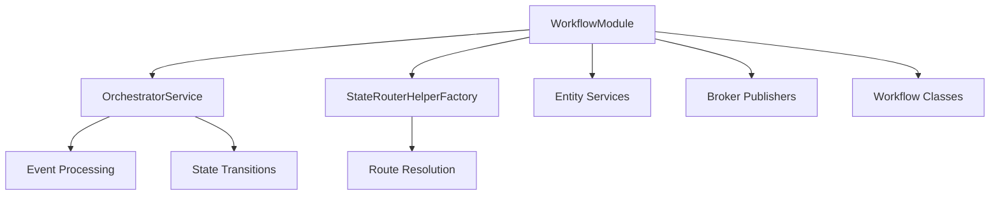

# WorkflowModule

The `WorkflowModule` is the main entry point for registering workflows, entities, and brokers.

## Import

```typescript
import { WorkflowModule } from 'nestjs-serverless-workflow/core';
```

## Static Methods

### `register(options)`

Registers the workflow module with the provided configuration.

#### Parameters

```typescript
WorkflowModule.register({
  imports?: any[];                    // Optional NestJS modules to import
  entities: Provider<IWorkflowEntity>[]; // Entity service providers
  workflows: Provider[];               // Workflow class providers
  brokers: Provider<IBrokerPublisher>[]; // Broker publisher providers
  providers?: Provider[];              // Additional providers
})
```

#### Returns

Returns a `DynamicModule` that can be imported into your NestJS module.

#### Example

```typescript
@Module({
  imports: [
    WorkflowModule.register({
      imports: [DatabaseModule],
      entities: [
        { provide: 'entity.order', useClass: OrderEntityService },
      ],
      workflows: [OrderWorkflow],
      brokers: [
        { provide: 'broker.order', useClass: SqsEmitter },
      ],
    }),
  ],
})
export class OrderModule {}
```

## Architecture



## Exports

The module exports the following services:

- `OrchestratorService` - Main workflow orchestration service
- `StateRouterHelperFactory` - Factory for creating router helpers
- All registered entity services
- All registered broker publishers
- All registered workflow classes

## Related

- [OrchestratorService](./services#orchestratorservice)
- [IWorkflowEntity](./interfaces#iworkflowentity)
- [IBrokerPublisher](./interfaces#ibrokerpublisher)

