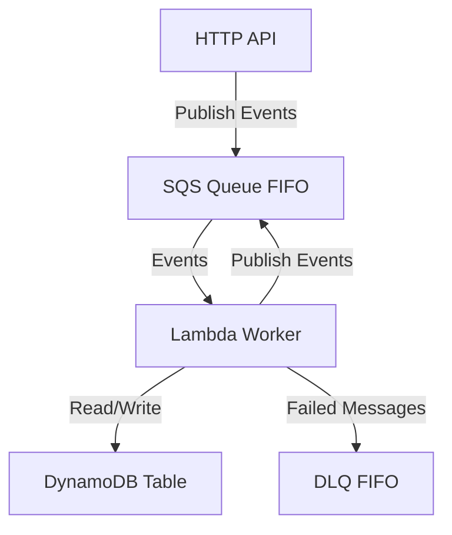
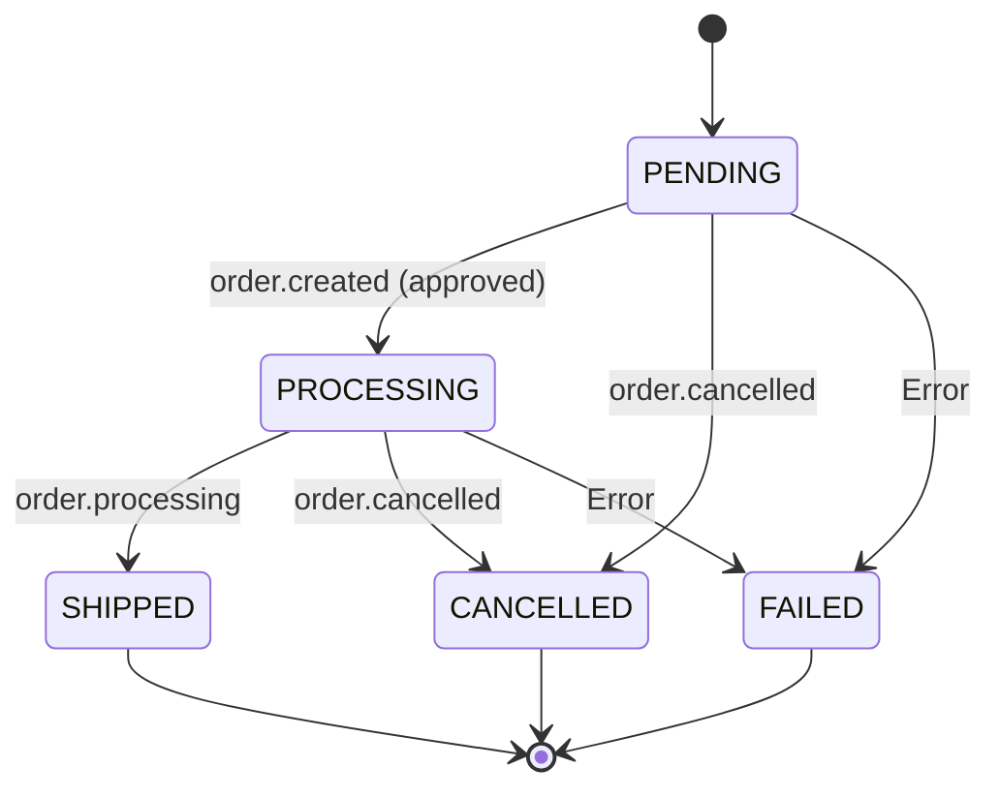

# Lambda Order State Machine Example

Complete AWS Lambda example demonstrating the `nestjs-serverless-workflow` library with SQS, DynamoDB, and serverless deployment.

## Overview

This example demonstrates a complete order processing workflow deployed to AWS Lambda with:

- SQS FIFO queue for reliable message processing
- DynamoDB for order state persistence
- Dead Letter Queue (DLQ) for failed messages
- Serverless Framework for deployment

## Architecture



## Features

- **Serverless Deployment**: Fully configured AWS Lambda with Serverless Framework
- **Event-Driven**: SQS FIFO queue for reliable message processing
- **State Persistence**: DynamoDB for order storage
- **Error Handling**: Dead Letter Queue (DLQ) for failed messages
- **Auto-Scaling**: On-demand DynamoDB and concurrent Lambda execution
- **Monitoring**: CloudWatch logs with 90-day retention
- **Batch Processing**: Process up to 10 messages per Lambda invocation

## Project Structure

```
lambda-order-state-machine/
├── src/
│   ├── broker/
│   │   └── mock-broker.service.ts    # SQS mock publisher
│   ├── dynamodb/
│   │   ├── client.ts                 # DynamoDB client
│   │   └── order.table.ts            # Order table definition
│   ├── order/
│   │   ├── order.constant.ts         # Constants and enums
│   │   ├── order.controller.ts       # HTTP endpoints
│   │   ├── order.module.ts           # NestJS module
│   │   ├── order.workflow.ts         # Workflow definition
│   │   └── order-entity.service.ts   # Entity service
│   ├── lambda.ts                     # Lambda handler
│   └── main.ts                       # HTTP server entry
├── serverless.yml                    # Serverless config
└── package.json
```

## Workflow States

The order workflow transitions through these states:



### State Transitions

1. **PENDING**: Order created, waiting for approval
2. **PROCESSING**: Order approved and being processed (triggered by `order.created` with `approved: true`)
3. **SHIPPED**: Order successfully shipped (triggered by `order.processing`)
4. **CANCELLED**: Order cancelled (manual)
5. **FAILED**: Order failed (on error)

## Installation

```bash
cd examples/lambda-order-state-machine
bun install
```

## Configuration

### Environment Variables

Create a `.env` file (optional for local development):

```env
AWS_REGION=us-east-1
STAGE=dev
DYNAMODB_TABLE=lambda-order-state-machine-orders-dev
```

### AWS Credentials

Ensure AWS credentials are configured:

```bash
aws configure
```

## Running Locally

### Start the HTTP Server

```bash
bun run local
# or
bun run dev  # with hot reload
```

The server will start on `http://localhost:3000`

### Test Endpoints

```bash
# Create an order (triggers workflow)
curl -X POST http://localhost:3000/orders \
  -H "Content-Type: application/json" \
  -d '{
    "items": ["item1", "item2"],
    "totalAmount": 150.00
  }'

# Get order status
curl http://localhost:3000/orders/{orderId}
```

## Deployment

### Build TypeScript

```bash
bun run build
```

### Deploy to AWS

```bash
# Deploy to dev stage
bun run deploy:dev

# Deploy to prod stage
bun run deploy:prod
```

### Deployment Output

After deployment, you'll see:

```
Service Information
service: lambda-order-state-machine
stage: dev
region: us-east-1
stack: lambda-order-state-machine-dev
resources: 12

functions:
  order-queue-worker: lambda-order-state-machine-dev-order-queue-worker

Outputs:
  OrdersTableName: lambda-order-state-machine-orders-dev
  OrderQueueUrl: https://sqs.us-east-1.amazonaws.com/.../lambda-order-state-machine-orders-dev.fifo
```

## Code Examples

### Workflow Definition

```typescript
@Workflow<Order, OrderEvent, OrderState>({
  name: 'OrderWorkflow',
  states: {
    finals: [OrderState.SHIPPED, OrderState.CANCELLED],
    idles: [OrderState.PENDING],
    failed: OrderState.FAILED,
  },
  transitions: [
    {
      event: OrderEvent.CREATED,
      from: [OrderState.PENDING],
      to: OrderState.PROCESSING,
      conditions: [(_entity: Order, payload?: { approved: boolean }) => payload?.approved === true],
    },
    {
      event: OrderEvent.PROCESSING,
      from: [OrderState.PROCESSING],
      to: OrderState.SHIPPED,
    },
    {
      event: OrderEvent.CANCELLED,
      from: [OrderState.PENDING, OrderState.PROCESSING],
      to: OrderState.CANCELLED,
    },
  ],
  entityService: ORDER_WORKFLOW_ENTITY,
  brokerPublisher: ORDER_WORKFLOW_BROKER,
})
export class OrderWorkflow {
  @OnEvent(OrderEvent.CREATED)
  async handleOrderCreated(@Entity() order: Order, @Payload() payload: any) {
    this.logger.log(`handleOrderCreated called for order ${order.id}`);
    return { processedAt: new Date().toISOString() };
  }

  @OnEvent(OrderEvent.PROCESSING)
  async handleOrderProcessing(@Entity() order: Order, @Payload() payload: any) {
    this.logger.log(`handleOrderProcessing called for order ${order.id}`);
    return { processingAt: new Date().toISOString() };
  }

  @OnDefault
  async fallback(entity: Order, event: string, payload?: any) {
    this.logger.warn(`Fallback called for order ${entity.id} on event ${event}`);
    return entity;
  }
}
```

### Lambda Handler

```typescript
import { NestFactory } from '@nestjs/core';
import { LambdaEventHandler } from 'nestjs-serverless-workflow/adapter';
import { type SQSHandler } from 'aws-lambda';
import { OrderModule } from './order/order.module';

const app = await NestFactory.createApplicationContext(OrderModule);
await app.init();

export const handler: SQSHandler = LambdaEventHandler(app);
```

### Entity Service

```typescript
@Injectable()
export class OrderEntityService implements IWorkflowEntity<Order, OrderState> {
  async create(): Promise<Order> {
    const order = {
      id: uuidv7(),
      status: OrderState.PENDING,
      createdAt: new Date().toISOString(),
    };
    await this.table.put(order);
    return order;
  }

  async load(urn: string): Promise<Order | null> {
    const result = await this.table.get({ id: urn });
    return result.Item || null;
  }

  async update(entity: Order, status: OrderState): Promise<Order> {
    entity.status = status;
    await this.table.put(entity);
    return entity;
  }

  status(entity: Order): OrderState {
    return entity.status;
  }

  urn(entity: Order): string {
    return entity.id;
  }
}
```

## Monitoring

### View Logs

```bash
# Tail logs in real-time
bun run logs

# Or with serverless directly
serverless logs -f order-queue-worker -t --stage dev
```

### CloudWatch Metrics

Monitor in AWS Console:
- Lambda Invocations
- SQS Messages (Sent, Received, Deleted)
- DynamoDB Read/Write Capacity
- Error Rates

## Testing

### Send Test Message to SQS

```bash
aws sqs send-message \
  --queue-url https://sqs.us-east-1.amazonaws.com/.../lambda-order-state-machine-orders-dev.fifo \
  --message-body '{"topic":"order.created","urn":"order-123","payload":{"approved":true},"attempt":0}' \
  --message-group-id "order-123" \
  --message-deduplication-id "$(uuidgen)"
```

### Invoke Lambda Directly

```bash
serverless invoke -f order-queue-worker \
  --data '{"Records":[{"body":"{\"topic\":\"order.created\",\"urn\":\"order-123\",\"payload\":{\"approved\":true},\"attempt\":0}"}]}'
```

## AWS Resources Created

1. **Lambda Function**
   - Runtime: Node.js 20.x
   - Memory: 1024 MB
   - Timeout: 15 minutes
   - Concurrency: 5 (reserved)

2. **SQS Queue (FIFO)**
   - Message retention: 14 days
   - Visibility timeout: 15 minutes
   - Max retries: 3
   - DLQ enabled

3. **DynamoDB Table**
   - Billing: On-demand
   - Point-in-time recovery: Enabled
   - Stream: Enabled (NEW_AND_OLD_IMAGES)
   - GSI: status-index

4. **Dead Letter Queue (FIFO)**
   - Message retention: 14 days
   - For failed messages after 3 retries

## Advanced Features

### Retry Logic

Failed messages are automatically retried up to 3 times with exponential backoff before moving to DLQ.

### Batch Processing

Lambda processes up to 10 messages per invocation for efficiency.

### Partial Batch Failures

Uses `ReportBatchItemFailures` to only retry failed messages in a batch.

### Auto-Timeout Handling

Lambda adapter gracefully stops processing 5 seconds before timeout to avoid message duplication.

## Cleanup

Remove all AWS resources:

```bash
serverless remove --stage dev
```

This will delete:
- Lambda function
- SQS queues (main + DLQ)
- DynamoDB table
- IAM roles
- CloudWatch log groups

## Related Documentation

- [Getting Started](../getting-started)
- [Workflow Module](../workflow)
- [Event Bus](../event-bus)
- [Lambda Adapter](../adapters)

